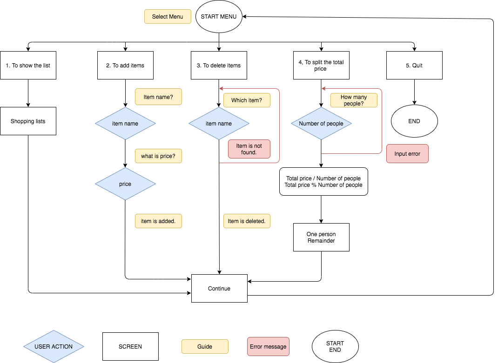

# Provide a link to your source control repository
<https://github.com/yrikw/shoppinglists/tree/main>

# Develop a statement of purpose and scope for your application. It must include:
-  describe at a high level what the application will do
-  identify the problem it will solve and explain why you are developing it
- identify the target audience
- explain how a member of the target audience will use it
-   300 - 500words

The application I created is “Shopping Lists”. The users can save what they need to buy or what they bought. There is a function they can put the price and the application automatically calculate the total price without a manual calculation. There are five menus. 1) To show the lists, 2) To add items to the lists, 3) To delete the items, 4) To split the total price and 5) To quit. It is very easy to add items or delete items. This application has a function to split the price. 

One of the problem when we go to shopping is sometimes it causes that we forget to buy something we need or buy unnecessary items. If you make a shopping list, it helps you to buy something financially and efficiency. It is very important to remind us what exactly you need and to see how much you spend. There are many applications to make shopping lists or manage money, however I developed very simple and easy to use without any complicated settings. In my experience, I tried to use some applications but every time I need to understand the difficult settings and which makes me thinking to develop my own shopping list application.

The target audience is someone who doesn’t need a various functions and elderly people ho doesn’t used to use complicated applications. Also, other people who just take a simple shopping memo. 

The target audience make a list with this application before they go to shop. It is very easy to use this application. They just need to follow the top menus and answer the questions. After they shop something, they can delete items or update items.  There is a menu who want to divide the total price with their friends or family, this application has a function to split the total price. 

# Develop a list of features that will be included in the application. It must include:
- at least THREE features
- describe each feature

Note: Ensure that your features above allow you to demonstrate your understanding of the following language elements and concepts:
- use of variables and the concept of variable scope 
loops and conditional control structures
 error handling
- Consult with your educator to check your features are sufficient .
- 300 words (approx. 100 words per feature)

## Feature 1
Feature 1 is Menu 4) To split the total price. When you select Menu 4), the application asks you how many people we want to share the total price. After you put the number of the people into the system, the system automatically calculates and shows the numbers. The numbers are how much we need to pay per a person and a remainder. If we put an alphabets or symbols when we put the number of the people, the application shows the error messages and says “ERROR: Please input a number” and let us to retry from asking us to put the number of people.

## Feature 2
Feature 2 is the top menu which has five menu lists. When we select one of the menu, we go to the menu page and we do whatever we need which is like adding items or deleting items. For example, when you select the menu 1), we can see the lists which we made and there is a message in the bottom which says “Press any key to go back to Menu”. After we press any keys, we go back to the  top menu and we can select different menus. Wherever we are in the application, the application let us to go back to the top menu.

## Feature 3 
Feature 3 is when we put the items or the prices in the application, it shows the result of the input and make a shopping list. We can add items in the menu 2) and delete the items in the menu 3). Once we save the items in the application, we can just use the name of items to add and delete it. wherever you are in the application, so it is easy to change the shopping lists many times. Also, the name of the item and the price are related together so if you delete the item, the price is also deleted too. 

# Develop an outline of the user interaction and experience for the application.
Your outline must include:
- how the user will find out how to interact with / use each feature
- how the user will interact with / use each feature
how errors will be handled by the application and displayed to the user
No word count

The user can easily find how to use feature. Top menu lists shows what you can do and select the number from 1 to 5. The application always ask you the question. For example, “What item do you want to add?” or “Press any key to go back to top menu.”, so the user just need to follow the questions and guidance.  
If there is an unexpected error, the application shows “An unexpected error is occurred.” In red by using an error handling. Even if the error comes up, it doesn’t bother the user to use the application. They can continue to use the application. In menu 4), the application asks you “How many people?”, but the user put an alphabet accidentally, the application let them know “Put the numbers.” and asks the same question again until they put any numbers.

# Develop a diagram which describes the control flow of your application. Your diagram must:
- show the workflow/logic and/or integration of the features in your application for each feature.
- utilise a recognised format or set of conventions for a control flow diagram, such as UML.

 
# Develop an implementation plan which:
- outlines how each feature will be implemented and a checklist of tasks for each feature
- prioritise the implementation of different features, or checklist items within a feature
- provide a deadline, duration or other time indicator for each feature or checklist/checklist-item
- Utilise a suitable project management platform to track this implementation plan
- Your checklists for each feature should have at least 5 items.

Trello Board
<https://trello.com/b/0Utg0uUv/terminal-app>

# Design help documentation which includes a set of instructions which accurately describe how to use and install the application.You must include:
- steps to install the application
- any dependencies required by the application to operate
- any system/hardware requirements

## How to install and start this application
1. The users will need ruby installed on their computers.
2. Download this repository to their local computers.
3. Open Command-line Interface
4. Open "src" folder: '''cd src''' 
5. Run the app: ruby: '''ruby terminal_app.rb'''

## System/hardware requirements for this application
- Command-line Interface
- Ruby
- Ruby gems: "Bundler", "Colorize"
