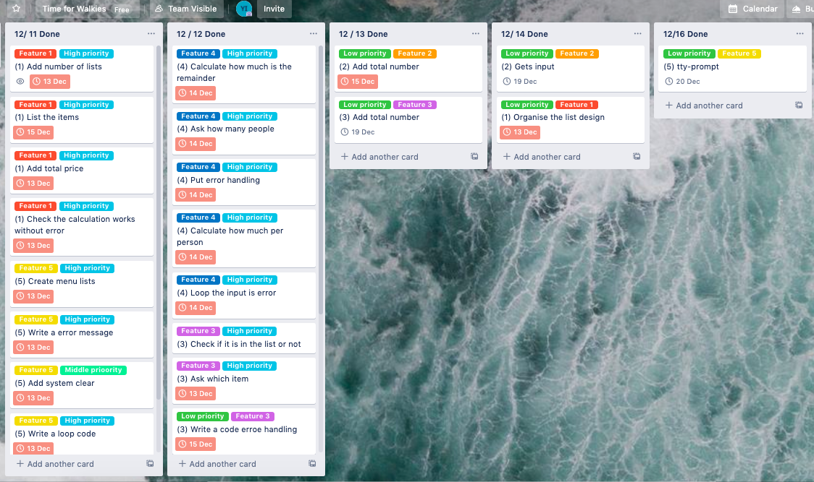

# Link to my source control repository
<https://github.com/yrikw/shoppinglists/tree/main>

# Purpose and scope for this application.

The application I created is “Shopping Lists”. The users can save as a list what they need to buy or what they bought. There is a function they can put the price and the application automatically calculate the total price without a manual calculation. There are five menus. 1) To show the lists, 2) To add items to the lists, 3) To delete the items, 4) To split the total price and 5) To quit. It is very easy to add items or delete items. 

One of the problem when we go to shopping is sometimes it causes that we forget to buy something we need or buy unnecessary items. If we make a shopping list, before we go shopping, it helps you to buy something financially and efficiency. It is very important to remind us what exactly we need to buy and to see how much we will spend. There are many applications to make shopping lists or manage our money, however I developed very simple and easy to use without any complicated settings. In my experience, I tried to use some applications but every time I need to understand the difficult settings, which makes me thinking to develop my own shopping list application.

The target audience is someone who doesn’t need a various functions and elderly people who isn't used to use complicated applications. Also, other people who just want to take a simple shopping memo. 

The target audience make a list with this application before they go to shop. It is very easy to use this application. They just need to select the top menu list and answer some questions or messages. After they shop something, they can delete items or update items.  There is a menu for the users who want to divide the total price with their friends or family, this application has a function to split the total price. 


# Features
## Feature 1
Feature 1 is Menu 4) To split the total price. When the users select Menu 4), the application asks them how many people they want to share the total price. After they put the number of the people into the system, the system automatically calculates and shows the numbers. The numbers are how much they need to pay per a person and the remainder. If they put an alphabets or symbols instead of numbers when they put the number of the people, the application shows the error messages and says “ERROR: Please input a number” and let them to retry to put the number of people. I used ```begin``` and ```rescue``` for error handling, so if the application can not calculate because of the alphabet, the rescue would be excuted and shows the error message. 

## Feature 2
Feature 2 is the top menu which has five menu lists. When the user select one of the menu, they go to the menu page and they do whatever they need which is like adding items or deleting items. For example, if they select the menu 1), they can see the lists which they made and there is a message in the bottom which says “Press any key to go back to Menu”. After they press any keys, they go back to the top menu and they can select different menus. Wherever they are in the application, the application guides them to go back to the top menu. This loop menu helps the users to understand the structure of the application easily.  

## Feature 3 
Feature 3 is when the users put the item names or the prices in the application, it shows the result of the input and make a shopping list. They can add items in the menu 2) and delete the items in the menu 3). Once they put the items in the application, they can just use the name of the items to add and delete it later wherever they are in the application, since I used variable for that, so it is easy to change the shopping list anytime. Also, the name of the item and the price are related together so if they delete the item, the price is also deleted too. The application gets the item name and the price using by ```gets = itemname ``` and I used  ```puts method name``` to output the result. 

# Develop an outline of the user interaction and experience for the application.
## How the user will find out how to interact with / use each feature
After the user starts the application, below top menu shows up. The user needs to select the menu depending on what they want to do. 

1. To show the lists
2. To add items
3. To delete items
4. To split the total price
5. Quit

## How to interecat with / use each features
Once he user selects menu, some questions come up and the user just need to answer the questions.
The application will add, delete or calculate by user's answer and show messages. Also, if the user adds many items in the list, they just need to type the item name, which helps them efficiently to add and delete items instead of scrolling and searching items in the list. 

2.  Q1 Which item do you want to add? / Q2 How much is the price
3.  Q1 Which item do you want to delete?
4.  How many people?
 
## Error handling
If there is an unexpected error, the application shows “An unexpected error is occurred.” In red by using an error handling. Even if the error comes up, it doesn’t bother the user to use the application. They can continue to use the application. In menu 4), the application asks you “How many people?”, but the user put an alphabet insstead of numbers accidentally, the application let them know “Put the numbers.” and asks the same question again until they put any numbers. In menu 3) if the user try to delete the item which they have already deleted, the application also shows error message. The user can know easily what is the error. 

# Develop a diagram which describes the control flow of your application. 


 
# Develop an implementation plan which:

Trello Board
<https://trello.com/b/0Utg0uUv/terminal-app>

## Feature 1
- Show total items
- Lists items
- Check if the calculation works without error
- Organize the design of the lists
- Show Total price

## Feature 2
- Ask a  Question (Item name)
- Gets input (Item name, price)
- Show the message "(item) is added.
- Ask a question(the price)
- Show total number

## Feature 3
- Ask question (Which itme)
- Write a code for error handling
- Check if the item is deleted
- Show the message "(item) is deleted."
- Show the message "(item) is not in the lists" 

## Feature 4
- Calculate the price per person
- Calculate the remainder
- Ask a question (how many people)
- Write a code for error handling (If the user puts alphabet instead of number)
- Loop until the user puts number

## Feature 5
- Write a error message "Choose menu 1 to 5"
- Add system clear
- Loop menu
- Show menu lists
- Quit menu / Show the message




# How to use and install the application
- steps to install the application
- any dependencies required by the application to operate
- any system/hardware requirements

## How to install and start this application
1. The users will need ruby installed on their computers.
2. Download this repository to their local computers.
3. Open Command-line Interface
4. Open "src" folder: 
``` cd src ```
5. Run the app: ruby: 
``` ruby terminal_app.rb ```
## System/hardware requirements for this application
- Command-line Interface
- Ruby
- Ruby gems: "Bundler", "Colorize", "artii", "tty-prompt"

# Manual Test code 
※Actaual code is in src folder / terminal_app_test.rb


